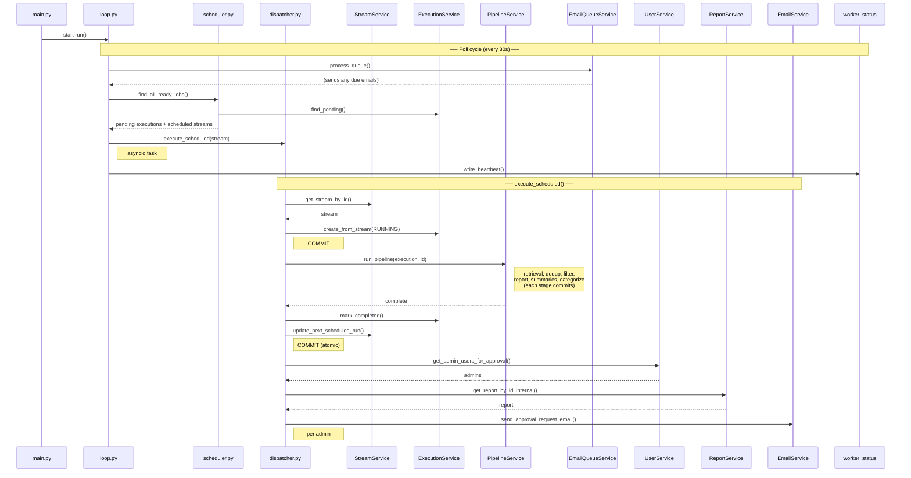
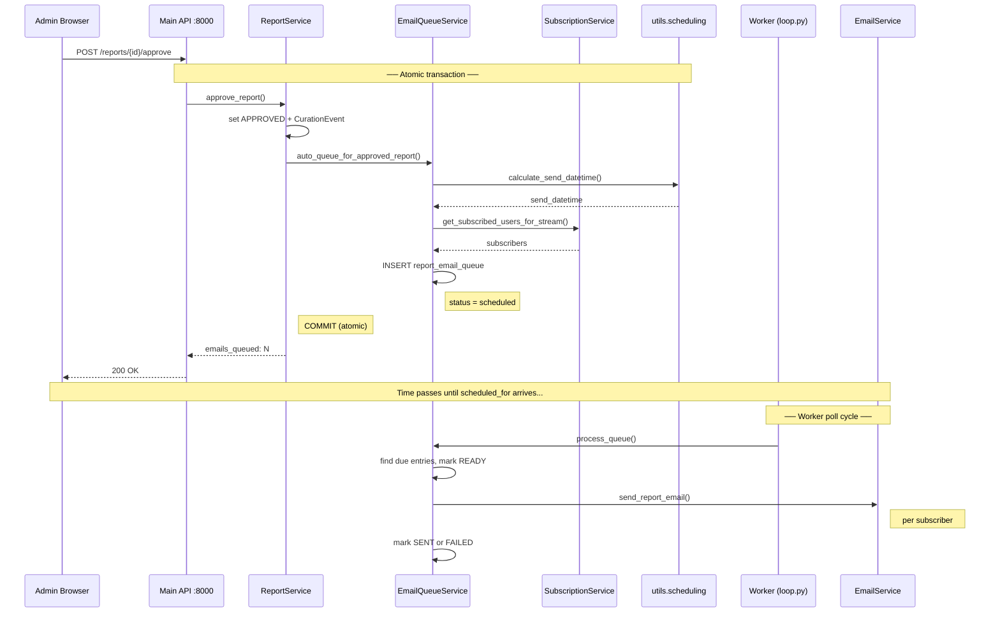

# Weekly Pipeline — Technical Architecture

How the weekly pipeline maps to code components, how they coordinate, and what remains to be built.

---

## System Components

### 1. Worker Process (`backend/worker/`)

Standalone FastAPI application (`worker/main.py`) on port 8001, separate from the main API server (port 8000). Two responsibilities:

- **Scheduler loop:** Polls every 30 seconds for work (pipeline jobs + email queue)
- **Management API:** HTTP endpoints for triggering runs, checking status, health checks

**Modules:**

| File | Role |
|------|------|
| `worker/main.py` | FastAPI app, lifespan (start/stop loop), logging, CLI entry point |
| `worker/loop.py` | Scheduler loop, poll cycle, email queue processing, heartbeat writes |
| `worker/scheduler.py` | `JobDiscovery` — queries DB for due streams and pending executions |
| `worker/dispatcher.py` | `JobDispatcher` — runs pipelines, advances schedule, notifies admins |
| `worker/api.py` | Management API (trigger runs, SSE status streaming, cancel, health) |
| `worker/state.py` | Shared state: running flag, active jobs dict, wake event |
| `worker/status_broker.py` | In-memory pub/sub for real-time execution status (SSE) |

**Concurrency model:** asyncio tasks, max 2 concurrent pipeline runs. No Celery, no Redis, no external task queue.

### 2. Main API Server (`backend/`)

FastAPI app (port 8000) deployed via Elastic Beanstalk. Handles all user-facing requests including the approval workflow.

**Key endpoints for this flow:**

| Endpoint | Router | Purpose |
|----------|--------|---------|
| `POST /api/reports/{id}/approve` | `curation.py` | Approve report → auto-queue emails |
| `POST /api/reports/{id}/reject` | `curation.py` | Reject report |
| `POST /api/operations/email-queue/schedule` | `operations.py` | Manually schedule emails |
| `POST /api/operations/email-queue/process` | `operations.py` | Manually trigger email sending |
| `GET /api/operations/worker-status` | `operations.py` | Check worker health (reads heartbeat) |
| `POST /api/operations/runs` | `operations.py` | Trigger manual pipeline run |

### 3. Database (MariaDB)

**Tables involved:**

| Table | Key Fields | Role |
|-------|-----------|------|
| `research_streams` | `schedule_config` (JSON), `next_scheduled_run` | Schedule definition, next run tracking |
| `pipeline_executions` | `status`, `run_type`, `job_config`, `report_id` | Execution tracking, config snapshot |
| `reports` | `approval_status`, `approved_by`, `approved_at` | Report + approval state |
| `report_email_queue` | `status`, `scheduled_for`, `sent_at`, `error_message` | Email delivery tracking |
| `worker_status` | `worker_id`, `last_heartbeat`, `active_jobs` | Worker heartbeat for monitoring |
| `curation_events` | `event_type`, `curator_id` | Audit log |

### 4. Shared Utilities

| File | Role |
|------|------|
| `utils/scheduling.py` | `calculate_next_run()`, `calculate_send_datetime()` — schedule math used by dispatcher, operations service, and email queue service |
| `services/email_service.py` | Singleton SMTP client for all outbound email |

---

## Sequence Diagrams

### Worker: Poll Cycle → Pipeline → Admin Notification

### Main API: Admin Approval → Email Queuing → Worker Sends

---

## Command and Control

### How the main API talks to the worker

The main API and worker are **decoupled via the database**. There is no direct HTTP call from the API to the worker.

- **Manual run trigger:** Main API creates a `PipelineExecution` with `status=pending`. Worker discovers it on next poll (≤30s). If running in-process, `worker_state.wake_scheduler()` pokes the scheduler immediately.
- **Email queuing:** Main API inserts rows into `report_email_queue`. Worker discovers due entries on next poll.
- **Schedule changes:** Main API updates `schedule_config` and `next_scheduled_run` on `research_streams`. Worker reads these on next poll.

This means: **if the worker process is not running, nothing happens.** Pipelines don't run. Emails don't send. There are no alerts. The system silently accumulates overdue work — which is why the heartbeat + admin status endpoint exist.

### Worker lifecycle

- **Start:** `python -m worker.main` or `uvicorn worker.main:app --port 8001`
- **Graceful shutdown:** Sets `running=False`, cancels scheduler task, waits up to 30s for active jobs
- **Health check:** `GET /worker/health` (on worker port 8001)
- **Monitoring from main API:** `GET /api/operations/worker-status` (reads `worker_status` table)

### Observability

- **Heartbeat:** Worker writes to `worker_status` table every poll cycle (30s). Main API reads this to report health. Stale heartbeat (>120s) = worker is down.
- **Logs:** `logs/worker.log` and stdout. In production, journald via systemd (`journalctl -u kh-worker`).
- **SSE streaming:** Per-execution status via `GET /worker/runs/{id}/stream` (on worker port 8001).
- **Active job tracking:** `worker_state.active_jobs` dict, exposed at `GET /` on worker port.

---

## Deployment

### What's deployed

| Component | Where | How |
|-----------|-------|-----|
| Main API | AWS Elastic Beanstalk (`knowledgehorizon-env`) | `deploy.ps1` → `eb deploy` |
| Frontend | AWS S3 (`www.knowledgehorizon.ai`) | `deploy.ps1` → `aws s3 sync` |
| Worker | Same EB instance, systemd service | `.ebextensions/worker.config` → `systemctl restart kh-worker` |

The worker runs as a systemd service (`kh-worker.service`) on the same EC2 instance as the main API. It restarts automatically on crash (`Restart=always`, `RestartSec=5`) and on every deploy (via `container_commands` in the `.ebextensions` config). Graceful shutdown timeout is 60 seconds.

### Remaining gaps

1. **No retry for failed emails:** Failed emails sit in the queue with `status=failed`. Consider adding a retry mechanism or at minimum an admin notification.

2. **No dead-letter / staleness handling:** If a pipeline takes too long or the worker restarts mid-run, executions can get stuck in `running` status. Need a stale-execution recovery mechanism.

3. **External monitoring:** The heartbeat + admin endpoint covers manual checks. For automated alerting, consider a CloudWatch alarm on the `worker_status.last_heartbeat` column or a simple cron that hits the status endpoint.
